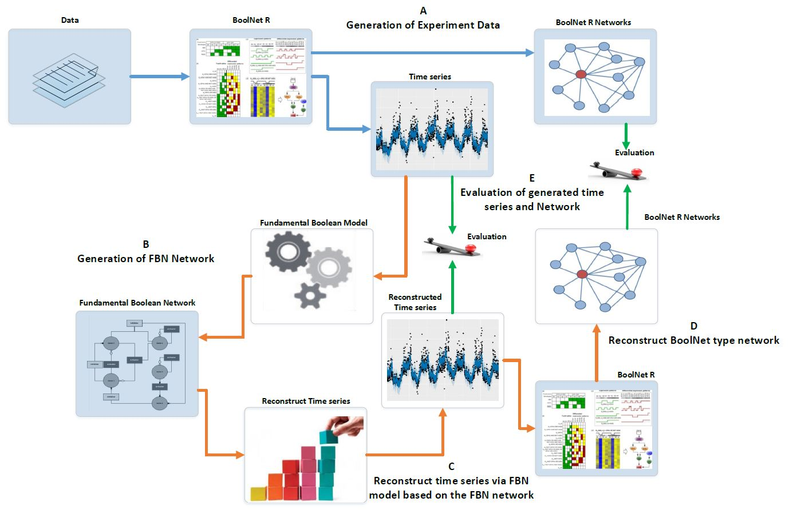

# Introduction
Fundamental Boolean modelling(FBM) has been proposed to draw insights into gene activation, inhibition, and protein decay. This
novel Boolean model provides an intuitive definition of activation and inhibition pathways
and includes mechanisms to handle protein decay issues. To prove the concept of
the novel model, we implemented a platform using R language, called FBNNet. Our
experimental results show that the proposed FBM could explicitly display the internal
connections of the mammalian cell cycle between genes separated into the connection
types of activation, inhibition and protein decay.

###This package FBNNet is exclusively built for [Fundamental Boolean Modeling](https://www.frontiersin.org/articles/10.3389/fphys.2018.01328/full "Fundamental Boolean Modeling") ###

# Experiment
The experiments conducted and described here intend to prove the concept of the new Boolean Model, i.e., the FBM. To verify the results, we apply the general processes described in Figure 1 as a benchmark to compare the results generated via BoolNet with these consequencely reconstructed from the new R package, FBNNet.

```{r, out.width = "100%"}

```
```
Figure 1 Evaluation assessment of Fundamental Boolean network inference using BoolNet. The blue arrows represent the processes using BoolNet and brown arrows represent the processes using our FBNNet R package. The green arrows represent the evaluation process. (A) We use the BoolNet script loadNetwork.R to load pre-defined networks from files and then generate the time series and networks; (B) We use the time series generated from BoolNet and the new R package, FBNNet, to generate FBNs; (C) We reconstruct the time series via the FBM; this process can be used to expand the short time series data; (D) To evaluate the FBM, we rebuild the BoolNet type network based on the reconstructed time series; and (E) We evaluate the FBN inference methods by comparing the generated time series and the generated BoolNet type of network with the original time series and network that were generated in step A.
```
## Data
```{r, out.width = "100%"}
library(BoolNet)
library(utils)
library(FBNNet)
data("ExampleNetwork")
ExampleNetwork
print(ExampleNetwork)
## show BoolNet type of network graph
BoolNet::plotNetworkWiring(ExampleNetwork)
```

## Extract the Fundamental Boolean Network
```{r, out.width = "100%"}
   initialStates <- generateAllCombinationBinary(ExampleNetwork$genes)
   trainingseries <- genereateBoolNetTimeseries(ExampleNetwork,
                                             initialStates,43, 
                                             type = "synchronous")
   FBNcellcyclenetwork <- generateFBMNetwork(timeseries_data = trainingseries, 
                                 maxK = 4, 
                                 max_deep_temporal = 1, 
                                 useParallel = FALSE,
                                 verbose = FALSE)
   print(FBNcellcyclenetwork)

   resultfile <- reconstructTimeseries(FBNcellcyclenetwork,
                                    initialStates,
                                    type = "synchronous", 
                                    maxTimepoints = 43, 
                                    useParallel = FALSE)

   similarreport <- generateSimilaryReport(trainingseries,resultfile)
   print(paste("ErrorRate=",similarreport$ErrorRate,sep = "",collapse = ""))
   print(paste("AccurateRate=",similarreport$AccurateRate,sep = "",collapse = ""))
   print(paste("MissMatchedRate=",similarreport$MissMatchedRate,sep = "",collapse = ""))
   print(paste("PerfectMatchedRate=",similarreport$PerfectMatchedRate,sep = "",collapse = ""))

   #get attractors
   genes <- rownames(trainingseries[[1]])

   attractor <- searchForAttractors(FBNcellcyclenetwork,initialStates,genes)
   print(attractor)
   #display the dynamic trajectory of the attactor 2
   FBNNetwork.Graph.DrawAttractor(FBNcellcyclenetwork,attractor,2)
```